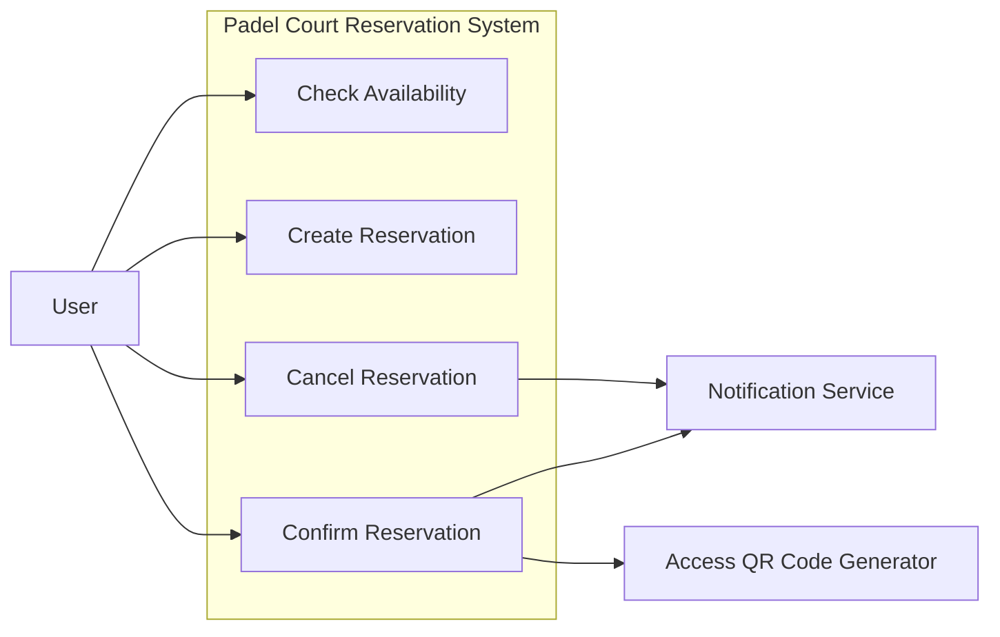
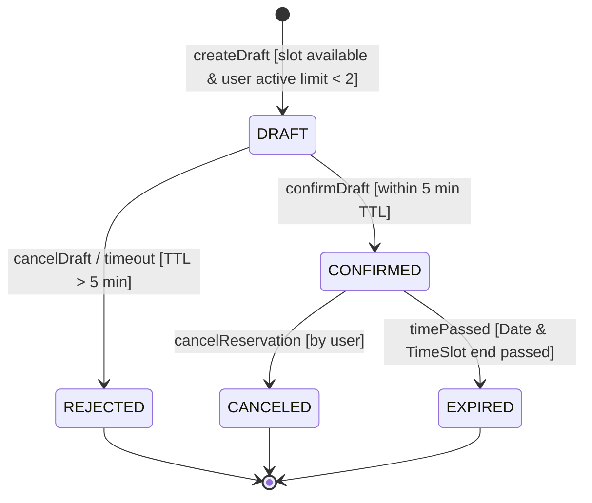
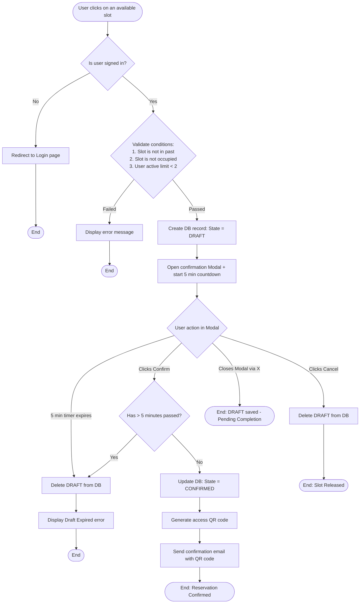
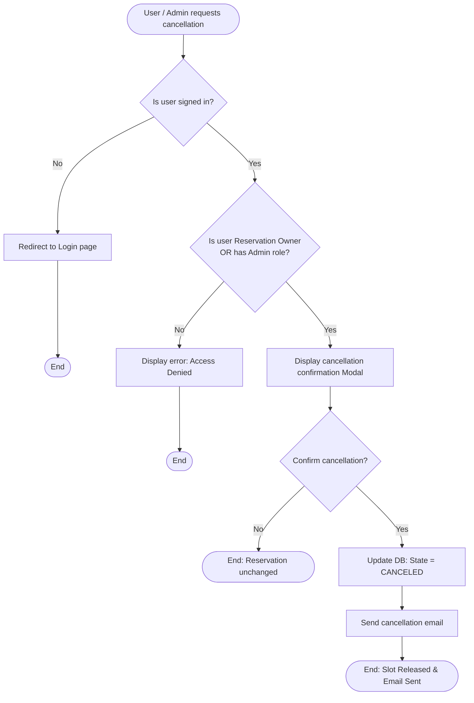

# Use case diagram

```mermaid
flowchart LR
    subgraph SystemBoundary ["Padel Court Reservation System"]
        UC1[Check Availability]
        UC2[Create Reservation]
        UC3[Confirm Reservation]
        UC4[Cancel Reservation]
    end

    User[User]
    NotificationService[Notification Service]
    QRCodeGenerator[Access QR Code Generator]

    User --> UC1
    User --> UC2
    User --> UC3
    User --> UC4

    UC3 --> NotificationService
    UC3 --> QRCodeGenerator
    UC4 --> NotificationService
```

# Reservation state diagram

```mermaid
stateDiagram-v2
    [*] --> DRAFT : createDraft [slot available & user active limit < 2]

    DRAFT --> CONFIRMED : confirmDraft [within 5 min TTL]
    DRAFT --> REJECTED : cancelDraft / timeout [TTL > 5 min]

    CONFIRMED --> CANCELED : cancelReservation [by user]
    CONFIRMED --> EXPIRED : timePassed [Date & TimeSlot end passed]

    REJECTED --> [*]
    CANCELED --> [*]
    EXPIRED --> [*]
```

# Activity Diagram: Create & Confirm Reservation (OP-01 & OP-03)

```mermaid
flowchart TD
    Start([User clicks on an available slot]) --> AuthCheck{Is user signed in?}
    
    AuthCheck -- No --> LoginRedirect[Redirect to Login page] --> EndLogin([End])
    
    AuthCheck -- Yes --> RulesCheck{Validate conditions:<br/>1. Slot is not in past<br/>2. Slot is not occupied<br/>3. User active limit < 2}
    
    RulesCheck -- Failed --> ShowError[Display error message] --> EndError([End])
    
    RulesCheck -- Passed --> CreateDraft[Create DB record: State = DRAFT]
    
    CreateDraft --> OpenModal[Open confirmation Modal + start 5 min countdown]
    
    OpenModal --> UserAction{User action in Modal}
    
    UserAction -- Clicks Confirm --> TTLCheck{Has > 5 minutes passed?}
    
    TTLCheck -- Yes --> ExpireDraft[Delete DRAFT from DB] --> ShowExpired[Display Draft Expired error] --> EndExpired([End])
    
    TTLCheck -- No --> ConfirmDB[Update DB: State = CONFIRMED]
    ConfirmDB --> GenQR[Generate access QR code]
    GenQR --> SendEmail[Send confirmation email with QR code]
    SendEmail --> SuccessState([End: Reservation Confirmed])
    
    UserAction -- Clicks Cancel --> CancelDraft[Delete DRAFT from DB]
    CancelDraft --> SlotReleased([End: Slot Released])
    
    UserAction -- Closes Modal via X --> KeepDraft([End: DRAFT saved - Pending Completion])
    
    UserAction -- 5 min timer expires --> ExpireDraft
```

# Activity Diagram: Cancel Reservation (OP-04)

```mermaid
flowchart TD
    Start([User / Admin requests cancellation]) --> AuthCheck{Is user signed in?}
    
    AuthCheck -- No --> LoginRedirect[Redirect to Login page] --> EndLogin([End])
    
    AuthCheck -- Yes --> PermCheck{Is user Reservation Owner<br/>OR has Admin role?}
    
    PermCheck -- No --> ErrPerm[Display error: Access Denied] --> EndPerm([End])
    
    PermCheck -- Yes --> ConfirmModal[Display cancellation confirmation Modal]
    
    ConfirmModal --> Choice{Confirm cancellation?}
    
    Choice -- No --> KeepRes([End: Reservation unchanged])
    
    Choice -- Yes --> UpdateDB[Update DB: State = CANCELED]
    UpdateDB --> SendEmail[Send cancellation email]
    SendEmail --> EndSuccess([End: Slot Released & Email Sent])
```
